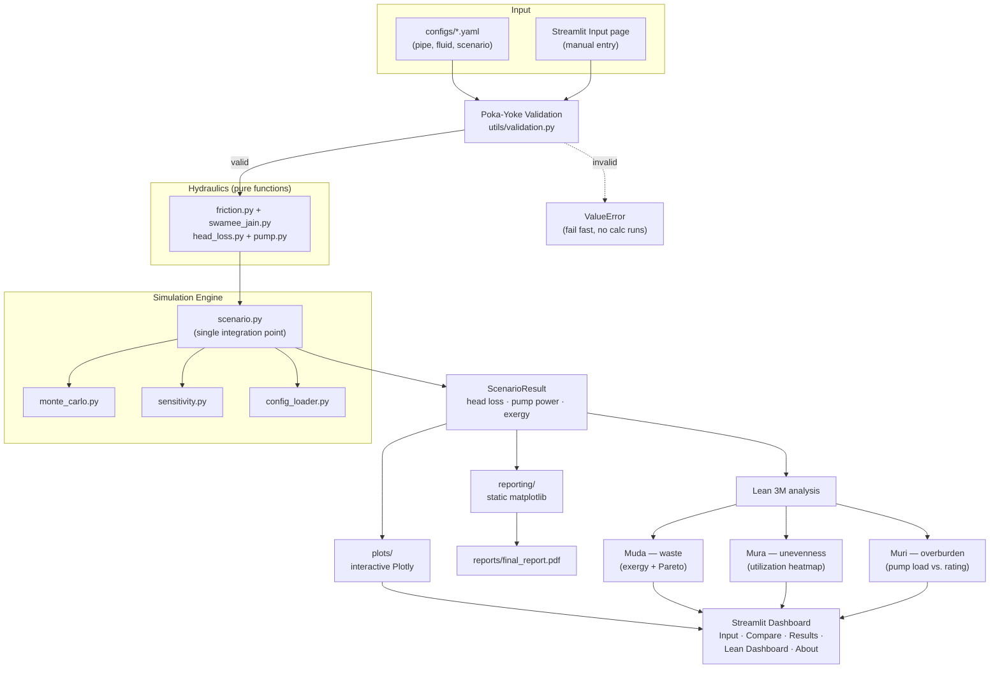

# Design Notes

## Origin

This package generalizes a one-off engineering calculation — comparing ½″
vs 4″ PVC pipe diameters for the Citra Srie Pradita housing estate water
distribution network — into a reusable, testable, config-driven tool. The
original analysis (Darcy-Weisbach head loss, Swamee-Jain friction factor,
Gouy-Stodola exergy destruction, pump sizing) is preserved exactly; what
changes is how it's organized and exposed.

## Architecture

**Flow, in words:** raw input (YAML config or Streamlit form) passes
through Poka-Yoke validation before any physics runs. Valid input flows
through the pure hydraulics functions, gets assembled into a
`ScenarioResult` by `scenario.py` (the one code path every caller —
dashboard, notebooks, Monte Carlo, sensitivity — shares), and from there
splits into two visualization paths (interactive Plotly for the dashboard,
static matplotlib for the PDF report) plus the Lean 3M analysis, which
itself feeds back into both the dashboard and the report.

## Why this separation?

- **`hydraulics/` contains pure functions only** — no I/O, no plotting, no
  config parsing. This makes every formula independently unit-testable
  (see `tests/test_friction.py`, `test_pump.py`) and reusable outside the
  simulation/dashboard context (e.g. directly in a Jupyter notebook).
- **`friction.py` vs `swamee_jain.py`**: `friction.py` owns the *generic*
  Darcy-Weisbach quantities (area, velocity, Reynolds number) and decides
  *which* friction-factor regime applies (laminar vs turbulent).
  `swamee_jain.py` owns the *specific* 1976 explicit correlations — not
  just the friction factor, but also the explicit design equations for
  solving diameter or flow rate directly from a target head loss. Keeping
  these separate means swapping in a different turbulent correlation (e.g.
  Colebrook-White iterative, Haaland) only touches one file.
- **`scenario.py` is the single integration point.** Both the Streamlit
  app and the Monte Carlo / sensitivity modules call `run_simulation()` —
  there is exactly one code path that combines head loss → pump power →
  exergy, so behavior can't silently drift between the dashboard and the
  batch analysis tools.
- **`plots/` vs `reporting/`**: both visualize the same underlying
  `ScenarioResult` objects, but for different outputs. `plots/` builds
  interactive Plotly figures for the Streamlit dashboard. `reporting/`
  builds static matplotlib PNGs (`figures.py`) and assembles them into
  `reports/final_report.pdf` via reportlab (`build_report.py`). The PDF
  path registers DejaVu Sans as the body font instead of the default
  Helvetica, since the methodology section's Greek symbols (ε, ρ, η, ν, μ)
  fall outside Helvetica's WinAnsi encoding and would otherwise render as
  missing glyphs.
- **Poka-Yoke validation runs inside the hydraulics functions themselves**
  (`head_loss.major_head_loss` calls `validate_pipe`/`validate_flow`/
  `validate_fluid` before computing anything), not just at the UI layer.
  This means *any* caller — Streamlit, a notebook, a Monte Carlo batch run
  — gets the same fail-fast guarantees, and `monte_carlo.py` explicitly
  catches and skips unphysical tail draws rather than crashing a 2000-run
  batch over one bad sample.

## Lean / Six Sigma Integration

| Lean concept | Implementation |
|---|---|
| **Poka-Yoke** (mistake-proofing) | `utils/validation.py` — hard input checks (raise) + soft SNI velocity / Muri checks (warn) |
| **Muda** (waste) | Exergy destroyed (`pump.exergy_destruction`) quantifies irrecoverable energy waste from friction; visualized via the Sankey diagram (per-scenario) and `plots/pareto.py`'s Pareto chart + waste ranking (across loss sources / across scenarios) |
| **Mura** (unevenness) | `plots/pareto.py::utilization_heatmap_figure` compares SNI-velocity utilization across all scenarios side by side, surfacing over- vs under-utilized pipe choices in one view |
| **Muri** (overburden) | `utils/validation.py::check_pump_load` compares required shaft power against an optional `PipeScenario.rated_power_W`, flagging >80% (approaching) and >100% (overloaded) |

All three converge on the **Lean Dashboard** Streamlit page
(`streamlit_app/pages/4_lean_dashboard.py`), which runs the config-driven
pipeline and shows Muri alerts, the Mura heatmap, and Muda's waste ranking
+ Pareto breakdown together — comparing *across* scenarios is what makes
Mura visible in the first place, so this page (unlike Results, which is
per-scenario) is built around the full scenario set. The PDF report's
section 8 mirrors this with the same underlying data.

## Known approximations

- The pressure-vs-distance plot assumes a uniform pipe (constant diameter
  and roughness along its length) and distributes minor losses as evenly
  spaced step-drops, since exact fitting positions aren't modeled.
- The Swamee-Jain explicit diameter equation is accurate to within roughly
  a few percent of iterative Colebrook-White over their stated validity
  range (5,000 < Re < 10⁸, 10⁻⁶ < ε/D < 10⁻²) — see the ~10% test
  tolerance in `tests/test_friction.py`. The flow-rate ("discharge")
  problem is instead solved via Brent's method directly against the
  verified friction-factor relation (rather than the explicit 1976
  discharge formula, whose published coefficients are inconsistent across
  secondary sources) — see the docstring in `swamee_jain.py` for the
  reasoning.
- `PipeScenario.static_head_m` (default 0.0) separates *useful* lift/
  delivery-pressure work from *destroyed* frictional exergy: the pump
  sizing (`shaft_power_W`) accounts for both, but
  `exergy.exergy_destruction_W` only counts the friction/minor-loss
  portion. Without this split, a pure friction-only model would always
  show 100% of hydraulic power as "destroyed" in the Sankey diagram —
  which is in fact correct for that idealized case (no elevation gain, no
  delivery pressure target), but becomes more informative once a real
  system's static head is supplied.

## Extension points

- Swap/extend the turbulent friction factor: add a new function to
  `swamee_jain.py` (or a new sibling module) and update
  `friction.darcy_friction_factor`'s dispatch.
- Add new fitting types: extend `head_loss.K_FACTORS`.
- Extend Mura beyond a single-pipe-per-scenario model: model an actual
  branching network (multiple pipe segments sharing a source) and feed
  per-segment utilization into `utilization_heatmap_figure` for a true
  network-balance view, rather than comparing independent scenarios.
