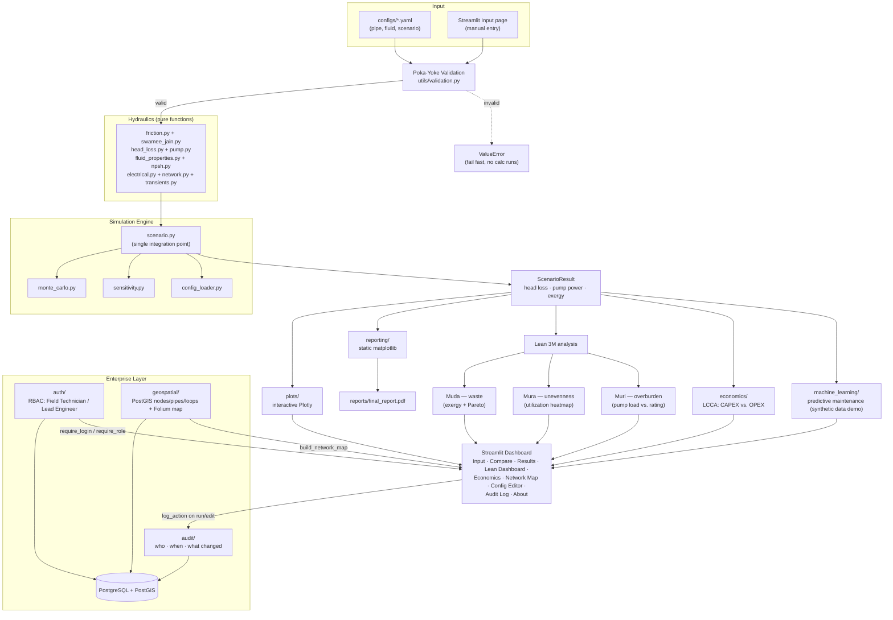

# Design Notes

## Origin

This package generalizes a one-off engineering calculation — comparing ½″
vs 4″ PVC pipe diameters for the Citra Srie Pradita housing estate water
distribution network — into a reusable, testable, config-driven tool. The
original analysis (Darcy-Weisbach head loss, Swamee-Jain friction factor,
Gouy-Stodola exergy destruction, pump sizing) is preserved exactly; what
changes is how it's organized and exposed.

## Architecture

**Flow, in words:** raw input (YAML config or Streamlit form) passes
through Poka-Yoke validation before any physics runs. Valid input flows
through the pure hydraulics functions, gets assembled into a
`ScenarioResult` by `scenario.py` (the one code path every caller —
dashboard, notebooks, Monte Carlo, sensitivity — shares), and from there
splits into two visualization paths (interactive Plotly for the dashboard,
static matplotlib for the PDF report) plus the Lean 3M analysis, which
itself feeds back into both the dashboard and the report.

## Why this separation?

- **`hydraulics/` contains pure functions only** — no I/O, no plotting, no
  config parsing. This makes every formula independently unit-testable
  (see `tests/test_friction.py`, `test_pump.py`) and reusable outside the
  simulation/dashboard context (e.g. directly in a Jupyter notebook).
- **`friction.py` vs `swamee_jain.py`**: `friction.py` owns the *generic*
  Darcy-Weisbach quantities (area, velocity, Reynolds number) and decides
  *which* friction-factor regime applies (laminar vs turbulent).
  `swamee_jain.py` owns the *specific* 1976 explicit correlations — not
  just the friction factor, but also the explicit design equations for
  solving diameter or flow rate directly from a target head loss. Keeping
  these separate means swapping in a different turbulent correlation (e.g.
  Colebrook-White iterative, Haaland) only touches one file.
- **`scenario.py` is the single integration point.** Both the Streamlit
  app and the Monte Carlo / sensitivity modules call `run_simulation()` —
  there is exactly one code path that combines head loss → pump power →
  exergy, so behavior can't silently drift between the dashboard and the
  batch analysis tools.
- **`plots/` vs `reporting/`**: both visualize the same underlying
  `ScenarioResult` objects, but for different outputs. `plots/` builds
  interactive Plotly figures for the Streamlit dashboard. `reporting/`
  builds static matplotlib PNGs (`figures.py`) and assembles them into
  `reports/final_report.pdf` via reportlab (`build_report.py`). The PDF
  path registers DejaVu Sans as the body font instead of the default
  Helvetica, since the methodology section's Greek symbols (ε, ρ, η, ν, μ)
  fall outside Helvetica's WinAnsi encoding and would otherwise render as
  missing glyphs.
- **Poka-Yoke validation runs inside the hydraulics functions themselves**
  (`head_loss.major_head_loss` calls `validate_pipe`/`validate_flow`/
  `validate_fluid` before computing anything), not just at the UI layer.
  This means *any* caller — Streamlit, a notebook, a Monte Carlo batch run
  — gets the same fail-fast guarantees, and `monte_carlo.py` explicitly
  catches and skips unphysical tail draws rather than crashing a 2000-run
  batch over one bad sample.

## Enterprise Layer: RBAC, Audit, Geospatial

### Why a real database, not just session state

RBAC and audit logging only mean something if they survive a server
restart and can't be bypassed by editing client-side state — so
`src/auth/`, `src/audit/`, and `src/geospatial/` are backed by
PostgreSQL (`src/db.py`), not just `st.session_state`. Session state
still holds the *current* logged-in user for the duration of a browser
session (`require_login()` checks it on every page), but the
authoritative records — who has which role, what happened when — live in
the database.

### Why PostGIS specifically, and not just lat/lon columns

Plain `DOUBLE PRECISION` lat/lon columns would work for storing point
coordinates, but PostGIS's `GEOMETRY` type and spatial functions
(`ST_MakeLine`, `ST_Y`/`ST_X`, GIST spatial indexes) are what make the
*pipe* geometry (a line between two nodes) a first-class queryable object
rather than something computed ad-hoc in Python every time. This matters
more as the network grows — a real GIS query like "which pipes pass
within 50m of this point" is a one-line PostGIS query against an indexed
column, not a full table scan with manual distance math.

### Why loop topology is a database table, not hardcoded

Early in development, the Hardy Cross loop definitions (`Loop`/
`LoopMember` — see `hydraulics/network.py`) were hardcoded directly in
the Streamlit page that needed them. That's fine for a fixed demo
network, but it means the *topology itself* — which pipes form which
loops — isn't really "data," it's code, which contradicts this project's
config-driven philosophy everywhere else. `network_loops` persists this
properly: `geospatial.service.get_all_loops()` returns real
`hydraulics.network.Loop` objects straight from the database, ready to
hand to `PipeNetwork.solve()`. The tradeoff: this repo's current Network
Map page still hardcodes the *initial flow guess* for the Hardy Cross
solver to its one demo topology's pipe names (`12`, `13`, `23`, `24`,
`34`) — extending to an arbitrary network shape would need either a
proper spanning-tree-based continuity solver or a UI for the user to
supply their own valid initial guess; out of scope for what this
demonstrates today (see Extension points below).

### Auth hardening: constant-time lookup, rate limiting, session expiry

Passwords are hashed with bcrypt (`src/auth/service.py`) — salted
automatically, adaptive cost factor, no plaintext ever stored or
compared. Three gaps flagged in an earlier version of this document have
since been closed:

- **Constant-time username lookup**: `authenticate()` previously
  returned immediately on a username-not-found lookup, which is
  measurably faster than running a real bcrypt comparison — a timing
  side-channel revealing which usernames are registered. It now runs a
  bcrypt comparison against a fixed dummy hash (`_DUMMY_PASSWORD_HASH`,
  computed once at import time, never used as a real credential) even
  when the username doesn't exist, so response time no longer depends on
  whether the account exists. Verified in
  `tests/test_auth.py::test_authenticate_timing_nonexistent_vs_wrong_password_is_similar`
  with a generous tolerance (sandboxed CI timing is noisy; this isn't a
  precision timing-attack benchmark, just a regression guard against
  reintroducing an obviously-fast early return).
- **Login rate limiting**: backed by the audit log rather than a new
  table — every failed login is already recorded as a `login_failed`
  entry, so `count_recent_failed_logins()` / `is_rate_limited()` just
  query recent entries for that username (default: 5 failures within 15
  minutes, both overridable via `HYDRAULIC_LOGIN_MAX_ATTEMPTS` /
  `HYDRAULIC_LOGIN_WINDOW_MINUTES`). A successful login resets the count.
  Applies to nonexistent usernames too — otherwise the rate-limit
  message itself becomes a second username-existence oracle. Checked by
  `render_login_form()` *before* calling `authenticate()`, so a
  rate-limited attempt is rejected without even touching the password.
- **Idle session expiry**: `require_login()` tracks
  `st.session_state["_last_activity_ts"]` and clears the session (with a
  message, and an audit log entry) if more than
  `HYDRAULIC_SESSION_TIMEOUT_SECONDS` (default 30 minutes) has passed
  since the last page interaction. This is an idle timeout, not an
  absolute session lifetime — any page load resets the clock.

All three are exercised by `tests/test_streamlit_rbac.py` using real
simulated login attempts (including a test that 5 failures block even a
*subsequent correct* password, and a test that rewinds the recorded
activity timestamp to simulate elapsed idle time) — not just unit tests
of the underlying `src/auth/service.py` functions in isolation.

Still not implemented, deliberately: password complexity requirements,
IP-based (rather than per-account) rate limiting, multi-factor auth,
SSO/OAuth. None of these were part of what this demonstrates; add them
if your actual deployment needs them.

### How RBAC is actually enforced (and how this is tested)

Every Streamlit page calls `require_login()` (renders a login form and
`st.stop()`s if not authenticated) and, on restricted pages,
`require_role()` (shows an access-denied message and `st.stop()`s if the
signed-in user's role doesn't match) — both in
`streamlit_app/auth_helpers.py`. This is enforced server-side on every
page load, not just hidden via UI — there's no client-controllable state
that bypasses it.

This is verified with Streamlit's official `AppTest` framework
(`tests/test_streamlit_rbac.py`), which actually runs each page script
and simulates real login form submissions — not just a code-reading
claim that RBAC "should" work. Writing these tests caught two real,
separate production bugs that no amount of `curl`-based HTTP-status
smoke testing could have found, since Streamlit serves its static HTML
shell with a 200 regardless of what the page's Python script does (the
script only runs, and can only fail, over the websocket connection after
the page loads):

1. A bare ternary expression used as a statement
   (`cols[1].error(...) if cond else cols[1].warning(...)`, with no
   assignment) silently triggers Streamlit's "magic" auto-display
   feature, which tried to introspect the source to label the result and
   crashed on the multi-line, backslash-continued expression. Fixed by
   rewriting as a proper `if/else` block (also just better style).
2. A pandas `DataFrame` column built from a list of dicts where some
   entries had `pump_load_warning: None` and others had a string value
   silently became a `float64` column with `None` coerced to `NaN` —
   and `bool(float('nan'))` is `True` in Python, so a plain truthiness
   check (`if row.get("pump_load_warning"):`) incorrectly entered the
   "there's a warning" branch and crashed calling `.lower()` on a float.
   Fixed by checking `isinstance(value, str)` instead of truthiness.

Both bugs had been silently present since the pages were first written
— `tests/test_streamlit_rbac.py` exists specifically because reviewing
the code by eye, or checking that pages return HTTP 200, wasn't enough to
catch either one.

## Lean / Six Sigma Integration

| Lean concept | Implementation |
|---|---|
| **Poka-Yoke** (mistake-proofing) | `utils/validation.py` — hard input checks (raise) + soft SNI velocity / Muri / NPSH checks (warn) |
| **Muda** (waste) | Exergy destroyed (`pump.exergy_destruction`) quantifies irrecoverable energy waste from friction; visualized via the Sankey diagram (per-scenario) and `plots/pareto.py`'s Pareto chart + waste ranking (across loss sources / across scenarios) |
| **Mura** (unevenness) | `plots/pareto.py::utilization_heatmap_figure` compares SNI-velocity utilization across all scenarios side by side, surfacing over- vs under-utilized pipe choices in one view |
| **Muri** (overburden) | `utils/validation.py::check_pump_load` compares required shaft power against an optional `PipeScenario.rated_power_W`, flagging >80% (approaching) and >100% (overloaded) |

All three converge on the **Lean Dashboard** Streamlit page
(`streamlit_app/pages/4_lean_dashboard.py`), which runs the config-driven
pipeline and shows Muri alerts, the Mura heatmap, and Muda's waste ranking
+ Pareto breakdown together — comparing *across* scenarios is what makes
Mura visible in the first place, so this page (unlike Results, which is
per-scenario) is built around the full scenario set. The PDF report's
section 8 mirrors this with the same underlying data.

## Known approximations

- The pressure-vs-distance plot assumes a uniform pipe (constant diameter
  and roughness along its length) and distributes minor losses as evenly
  spaced step-drops, since exact fitting positions aren't modeled.
- The Swamee-Jain explicit diameter equation is accurate to within roughly
  a few percent of iterative Colebrook-White over their stated validity
  range (5,000 < Re < 10⁸, 10⁻⁶ < ε/D < 10⁻²) — see the ~10% test
  tolerance in `tests/test_friction.py`. The flow-rate ("discharge")
  problem is instead solved via Brent's method directly against the
  verified friction-factor relation (rather than the explicit 1976
  discharge formula, whose published coefficients are inconsistent across
  secondary sources) — see the docstring in `swamee_jain.py` for the
  reasoning.
- `PipeScenario.static_head_m` (default 0.0) separates *useful* lift/
  delivery-pressure work from *destroyed* frictional exergy: the pump
  sizing (`shaft_power_W`) accounts for both, but
  `exergy.exergy_destruction_W` only counts the friction/minor-loss
  portion. Without this split, a pure friction-only model would always
  show 100% of hydraulic power as "destroyed" in the Sankey diagram —
  which is in fact correct for that idealized case (no elevation gain, no
  delivery pressure target), but becomes more informative once a real
  system's static head is supplied.

## Extension points

- Swap/extend the turbulent friction factor: add a new function to
  `swamee_jain.py` (or a new sibling module) and update
  `friction.darcy_friction_factor`'s dispatch.
- Add new fitting types: extend `head_loss.K_FACTORS`.
- ~~The Network Map's initial flow guess hardcodes the demo network's
  exact pipe names~~ — resolved:
  `hydraulics.network.compute_initial_flows_spanning_tree` constructs a
  continuity-satisfying initial guess for *any* connected topology via a
  spanning-tree decomposition (tree edges solved by back-substitution
  from the leaves, chord edges start at zero — the standard Hardy Cross
  starting point). External supply/demand is now persisted per-node
  (`GeoNode.external_flow_m3s`) rather than read from a page-local
  constant. Verified by confirming two *different* valid initial guesses
  (the old hand-crafted one and the new generic one) converge to the
  identical physical solution
  (`tests/test_network.py::test_spanning_tree_and_hand_crafted_guess_converge_to_same_solution`).
  What's still out of scope: networks with multiple disconnected
  components (raises a clear error rather than solving each separately),
  and no UI yet for adding/editing nodes-and-pipes interactively (the
  Network Map page can seed the demo topology or read whatever's already
  in the database, but building a new arbitrary network still means
  calling `geospatial.service.upsert_node/upsert_pipe/upsert_loop_member`
  directly, not a form in the page).
- ~~Auth hardening: session expiry, rate limiting, constant-time
  lookup~~ — resolved, see "Auth hardening" above. Still open: password
  complexity rules, IP-based rate limiting, MFA, SSO/OAuth.
- The Config Editor writes directly to `configs/*.yaml` on disk, which
  is fine for `docker compose` (volume-mounted, durable) but doesn't
  survive a redeploy on ephemeral-filesystem platforms (Streamlit
  Community Cloud) — moving config storage into the database (with YAML
  export/import for the config-driven-pipeline modules that expect files)
  would remove that platform-dependent gap.
